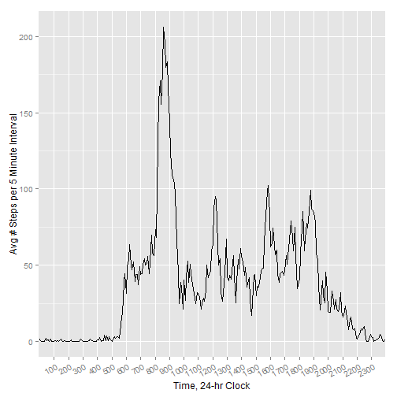
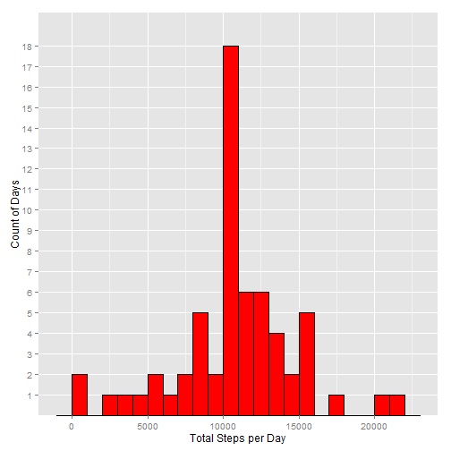
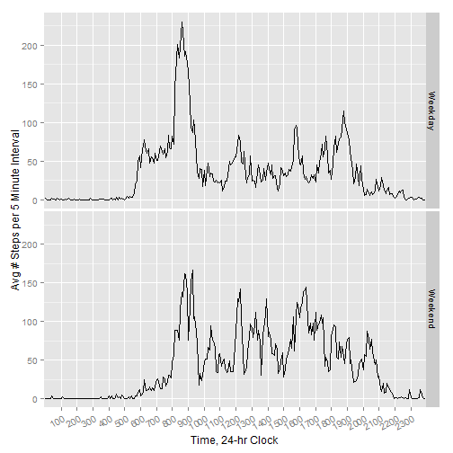

# Introduction
The purpose of this document and exercise is to create an example of reproducible research based on an initial exploration of a dataset which records the number of steps taken by a subject wearing an electronic activity monitoring device.

The raw data is contained in the file "activity.csv", which contains a text table in which each row corresponds to a measurement of steps in a 5 minute interval.   The columns of the table are "steps", the count of steps, "date", the date in YYYY-MM-DD text format, and "interval".  The label for interval is the 24-hour clock time at the beginning of the interval. 

To make our discussion simpler, we shall assume our subject is an androgynous person named Pat.

# Loading and Preprocessing the Data
The raw activity data is read into a data frame with fields "steps", "date"", and "interval".  date is a 61-level factor with a level for each date.

```r
stepdata<-read.csv("activity.csv")
stepdata[,1]<-as.numeric(stepdata[,1])  #convert to numeric to store non-integer averages
stepdata[,3]<-factor(stepdata[,3])      #convert to factor so graphs don't bridge from x:55 to x+1:00
# In preparation for analysis, load the packages "dplyr", "ggplot2", and "scales"
library("dplyr", lib.loc="C:/Program Files/R/R-3.2.0/library")
library("ggplot2", lib.loc="C:/Program Files/R/R-3.2.0/library")
library("scales", lib.loc="C:/Program Files/R/R-3.2.0/library")
```


# Mean Total Number of Steps per Day

The distibution of the total number of steps per day has a mode at 10,000 to 11,000 steps, about equal to the mean and median. Most days fall between 8,000 and 16,000 steps with small tails above and below.  Two days show steps of less than 100, which suggests a measurement error, unless Pat was bedridden.  In fact, all of the days with less than 5,000 steps should be checked for the possibility of device malfunction or Pat forgetting to wear it.


```r
StepbyDate<-
    group_by(stepdata,date) %>%
    summarise(Totstep=sum(steps))
StepHist<-ggplot(StepbyDate,aes(x=Totstep))+geom_histogram(fill="red",colour="black",binwidth=1000)+scale_y_discrete(breaks=1:10)
StepHist+xlab("Total Steps per Day")+ylab("Count of Days")
```

 

```r
meandailysteps<-comma(mean(StepbyDate$Totstep,na.rm=T),digits=6)
mediandailysteps<-comma(median(StepbyDate$Totstep,na.rm=T),digits=6)
```

The mean number of steps per day is 10,766.2.

The median number of steps per day is 10,765.


# Average Daily Activity Pattern

The graph below of steps per 5-minute interval shows that Pat generally starts the day at about 5:30 am.  The small blips in the morning before that probably are trips to the bathroom and back to bed.  There is a period from 6 to 8 am with about 50 steps per interval suggesting walking around getting dressed and preparing breakfast, although 2 hours seems like an unusually long time for that.

The largest peak of the day starts at 8 am and runs to about 9:30.  This is probably walking to work, catching a bus, or a lengthy walk from the parking lot.  The interval from 9:30 to about noon is probably working at a desk with occasional coffee trips.  From 12 to 12:30 there is a small peak corresponding to a lunch break.  The small number of steps suggests that Pat has lunch at the office and maybe walks to the break room, cafeteria or kitchen.

Following lunch there is a quiet period to about 3:30 similar to the morning work period.  It's curious that there is no single peak in the afternoon as large as the morning peak.  This could be caused by Pat having several different quitting times on different days of the week.  There are 3 small peaks centered around 4pm, 5:30pm and 6 to 7 pm, which may correspond to different quitting times.

The evening tapers off, and it appears that Pat hits the sack about 10:30 or 11 pm.

```r
StepbyTime<-
    group_by(stepdata,interval) %>%
    summarise(Avgstep=mean(steps,na.rm=T))
ggplot(StepbyTime,aes(x=interval, y=Avgstep, group=1))+geom_line()+ylab("Avg # Steps per 5 Minute Interval")+xlab("Time, 24-hr Clock") +scale_x_discrete(breaks=seq(100,2300,by=100))+theme(axis.text.x=element_text(angle=30,hjust=1))
```

 

```r
MaxSteps<- comma(max(StepbyTime$Avgstep),digits=4)
MaxInterval<-StepbyTime[which.max(StepbyTime$Avgstep),1]
```
The maximum number average number of steps in a 5 minute interval is 206.2. This occurs in the interval beginning at 835.

# Imputing Missing Values

In order to adjust for missing values, our analysis considered the time interval of the missing value and inserted the average number of steps taken from available data for that same interval.  This approach allows the profile of steps by clock time to be less affected by missing data, assuming that missing data is spread more evenly over clock times.


```r
naindex<-which(is.na(stepdata$steps))
nacount<-comma(length(naindex),digits=4)
stepdata2<-stepdata
for (i in naindex) {stepdata2[i,1]<-StepbyTime[StepbyTime$interval==stepdata$interval[i],2]}

StepbyDate2<-
    group_by(stepdata2,date) %>%
    summarise(Totstep=sum(steps))
StepHist<-ggplot(StepbyDate2,aes(x=Totstep))+geom_histogram(fill="red",colour="black",binwidth=1000)+scale_y_discrete(breaks=1:20)
StepHist+xlab("Total Steps per Day")+ylab("Count of Days")
```

 

The total number of missing values is 2,304.  After inserting values for NA variables in the raw data, the histogram above is produced.  The only change from the histogram ignoring NA values is that the mode at 10,000 to 11,000 steps has increased from 10 to 18.  Also, the mean and median number of steps are now equal to 6 digits.


```r
meandailysteps<-comma(mean(StepbyDate2$Totstep),digits=6)
mediandailysteps<-comma(median(StepbyDate2$Totstep),digits=6)
count(stepdata[naindex,],date)
```

```
## Source: local data frame [8 x 2]
## 
##         date   n
## 1 2012-10-01 288
## 2 2012-10-08 288
## 3 2012-11-01 288
## 4 2012-11-04 288
## 5 2012-11-09 288
## 6 2012-11-10 288
## 7 2012-11-14 288
## 8 2012-11-30 288
```


The mean number of steps per day is 10,766.2.

The median number of steps per day is 10,766.2.

Barring an error in the correction, this suggests that all of the NA values covered entire days, so there are an equal number of averages for each time interval.  To investigate, we counted the number NA values per day and see that there are 8 days where all step values are NA, as expected.

# Differences in Weekdays vs Weekends


```r
daytype<-weekdays(as.Date(stepdata2$date))
daytype<-data_frame(daytype)
daytype[daytype == "Saturday"]<-"Weekend"
daytype[daytype == "Sunday"]<-"Weekend"
daytype[daytype != "Weekend"]<-"Weekday"
stepdata2<-bind_cols(stepdata2,daytype)
StepbyTime2<-
    group_by(stepdata2,daytype,interval) %>%
    summarise(Avgstep=mean(steps))
ggplot(StepbyTime2,aes(x=interval,y=Avgstep,group=1))+geom_line()+ylab("Avg # Steps per 5 Minute Interval")+xlab("Time, 24-hr Clock")+scale_x_discrete(breaks=seq(100,2400,by=100))+facet_grid(daytype ~ .)+theme(axis.text.x=element_text(angle=30,hjust=1))
```

 

The graph above uses facets to separate data of weekdays from weekends.  The weekday data graph is close enough to the full week graph that the observations made in that section still apply.

The weekend graph, however, is distinctly different from the weekday graph.  It appears that Pat occasionally rises at 5:30, but more often around 8am.  From 8 to 9:30, there is a broad peak in activity, possibly corresponding to a morning run, followed by a lull.  For the rest of the day, there are alternating peaks and lulls, with one broad peak running from about 4pm to 6pm.  Bedtime appears to be at 10pm on weekends, even more definitely than during weekdays.  Ol' Pat is apparently not a party animal.

